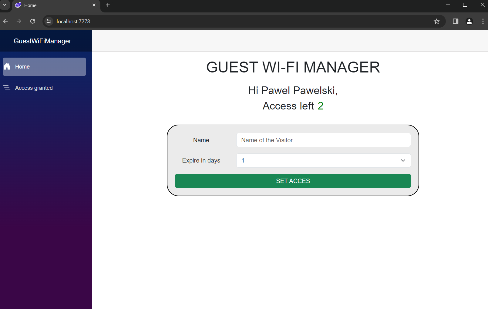
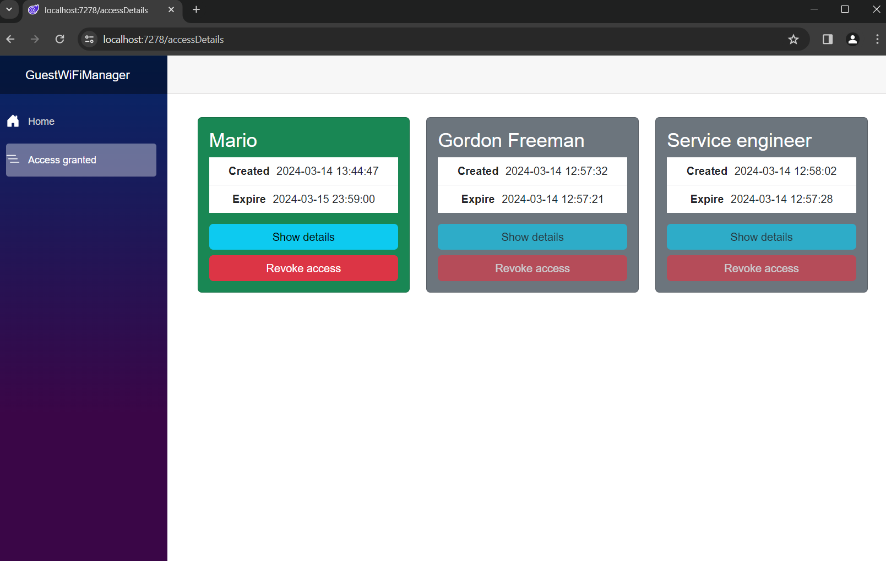
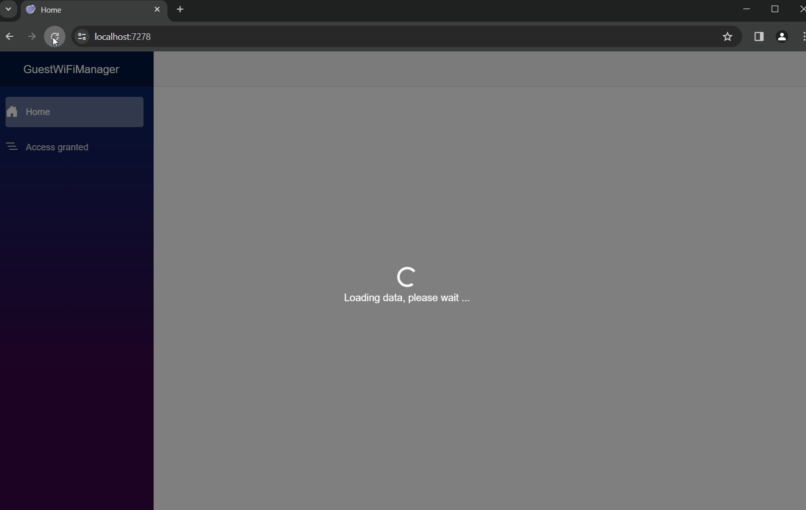
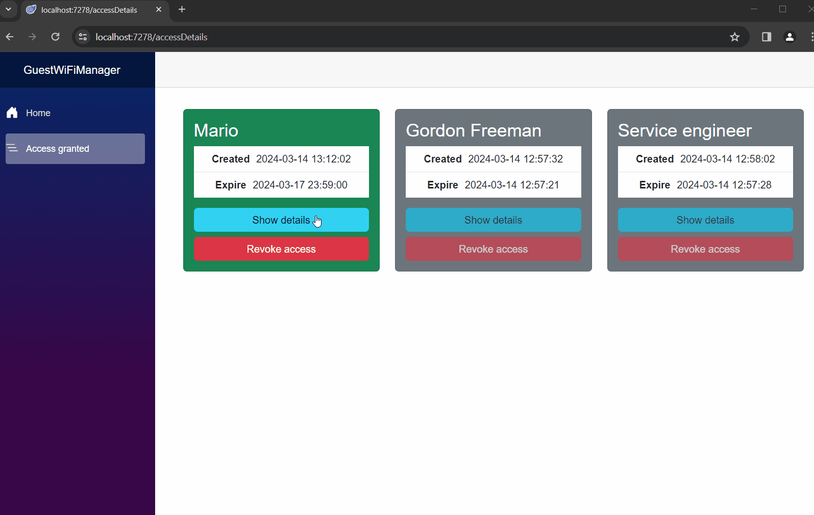
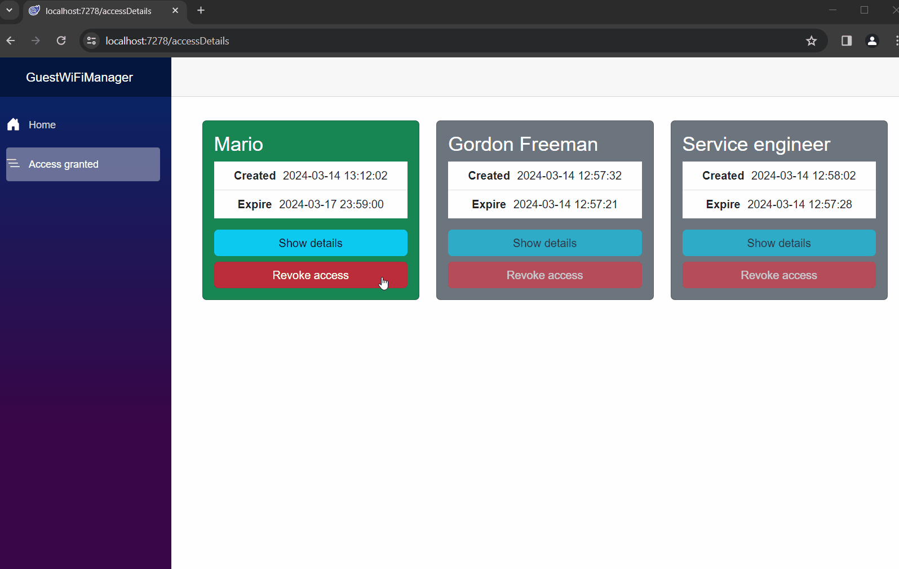

# Guest Wi-Fi Manager - Cisco Meraki
**Automation for granting Wi-Fi access to visitors**  
  
The application is used to grant access to Wi-Fi network on the Cisco Meraki platform. With this application you can quickly and conveniently grant access to the Internet to a visitor in your company, view who currently has access and when it will expire, and revoke access if necessary. With this application, the employee can grant access to Wi-Fi without the involvement of the IT department. All the admin needs to do beforehand is to prepare a separate SSID for this purpose and to prepare accounts for the user on the Meraki platform. The user can grant access for a maximum of 5 days (this can be configured)  
The application also uses an SQL database to store encrypted passwords that the application can decrypt. This is needed because the password cannot be retrieved from Meraki and the user may want to see what password has been set - this is not dangerous as the SSID is separate from the company network and the password will expire after a maximum of 5 days, plus the admin can change it or deactivate the account.

# What I have learned
- Blazor
- better understand C# and Python
- better understanding of working with APIs
- Azure Key Vault
- Flask framework
- Bootstrap and Blazor Bootstrap

# Screenshots

**Home page**  
  

**Access details page**  
  

**Initial page load**  
When the page is opened, the data is loaded (not allowing the user to click on anything) and then the user's name and the number of accounts he or she has left are displayed on the basis of this data. If the value is 0, the "Set access" button becomes inactive  
  

**Set access**  
The email shown below does not exist, it is just a name from the Meraki platform. It is possible to enter the real address to which a password will be sent with access to Wi-Fi, but this will not work if the visitor needs access to the Internet because his/her phones do not have a signal  
  

**Check password**  
  

**Revoke access**  
After that, page is reloaded to refresh the data  
  